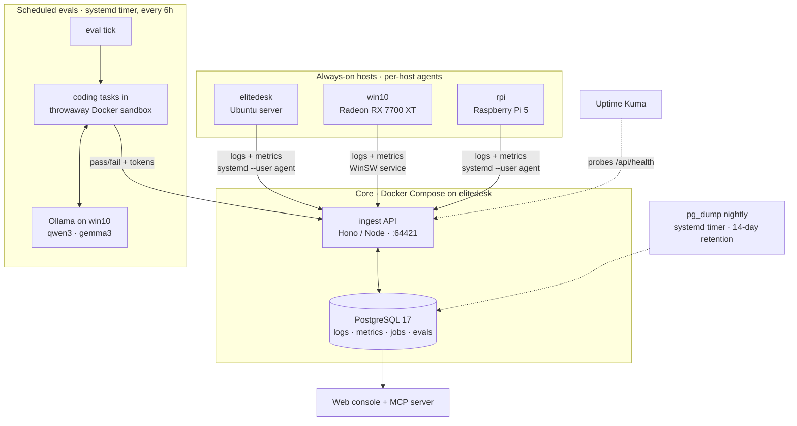

# home-ops

**A self-hosted operations stack for a three-machine home network — centralized logging, host metrics, automated backups, and scheduled local-LLM benchmarking, all on a single Postgres behind a private mesh network.**

[](https://github.com/PiotrRomanczuk/home-ops/actions/workflows/check.yml)


This is a system I run daily on real always-on hardware — deployed, monitored, backed up, and CI-gated like a small production service, not a tutorial follow-along. I built it to consolidate the logs and metrics scattered across my home network into one place, and it doubles as a hands-on practice ground for Linux/DevOps fundamentals (systemd, storage, networking, containers) on the path toward RHCSA/RHCE.

---

## Architecture



Three always-on hosts each run a small agent that ships logs and metrics to a single ingest API backed by one PostgreSQL instance. The same database drives a scheduled harness that benchmarks local LLMs on the GPU box. A web console and an [MCP](https://modelcontextprotocol.io) server read it all. **Nothing is exposed to the public internet** — every path is reachable only over a Tailscale mesh.

→ Full component map, data flows, and design rationale: [`docs/ARCHITECTURE.md`](docs/ARCHITECTURE.md)

---

## What it does

### Centralized observability — one timeline across the network
Each host runs a Python agent — a **systemd user service** on Linux, a **WinSW service** on Windows — that tails `journald` / Docker / application logs and samples CPU, memory, disk, network, and GPU every 30 seconds, batching them over a token-authenticated HTTP API into `host_logs` and `host_metrics`. One log timeline and one metrics table for the whole network, joinable in plain SQL, with process-level attribution stored in a JSONB column. Volume runs 50k–500k log rows/day, pruned to 30 days by `pg_cron`.

### Scheduled local-LLM evaluation — the live GPU workload
A **systemd timer** fires every 6 hours and runs a set of coding tasks through local models (Ollama — `qwen3`, `gemma3`) inside **throwaway Docker sandboxes**, recording pass/fail and token throughput back into the same database. A kanban board in the web console manages each task's lifecycle (idea → building → testing → active). The GPU box also reports when a game is running — the basis for gaming-aware scheduling, so heavy background GPU work can defer to foreground play.

---

## Skills demonstrated

| Area | In this repo |
| --- | --- |
| **Linux administration** | systemd unit & timer authoring (user scope), `journald` log shipping, service persistence across reboots (`loginctl enable-linger`) |
| **Containers** | Docker Compose stack with healthchecks; ephemeral sandboxes to run untrusted eval code in isolation |
| **PostgreSQL** | schema design, idempotent SQL migrations, `pg_cron` scheduled retention, partial indexes, a `SKIP LOCKED` work queue |
| **Backup & retention** | nightly `pg_dump -Fc` via systemd timer, 14-day rotation (off-host NAS target is the next hardening step — see [Status](#status--roadmap)) |
| **CI/CD** | GitHub Actions — typecheck, lint, multi-language compile, `docker compose build`, unit tests + an integration test against a real Postgres, and secret scanning (**9 checks, green on every push**) |
| **Observability** | centralized logs + metrics with process attribution; `/api/health` backing the Docker healthcheck and an Uptime Kuma probe |
| **Networking & security** | Tailscale / WireGuard mesh, zero public exposure, token auth for machines + cookie auth for the console, no secrets in source (GitGuardian-scanned) |
| **Scripting** | Python agents, Bash (ops scripts), PowerShell (Windows GPU perf-counter sampling) |

---

## Tech stack

**Data** PostgreSQL 17 · pg_cron  
**Services** Node / Hono (TypeScript) · Python 3 · Docker Compose  
**Process management** systemd (`--user` units & timers) · WinSW  
**AI/GPU** Ollama (qwen3, gemma3, bge-m3) on a Radeon RX 7700 XT  
**Platform** Tailscale · GitHub Actions · Uptime Kuma

---

## How it's operated

**Deploy** (from the always-on server):
```bash
ssh elitedesk
cd ~/logs-stack
git pull && docker compose up -d --build
```
Per-host agents run as systemd `--user` services (Linux) or WinSW services (Windows).

**Health check** — public, unauthenticated, and wired into the Docker healthcheck:
```bash
curl -s http://<host>:64421/api/health   # -> {"ok":true}
docker compose ps                          # ingest + postgres -> (healthy)
```

**CI** — every push and PR runs 9 checks: typecheck/lint, Python compile, Bash lint, `docker compose build`, Vitest, unittest, an integration test against a **real Postgres** container, and GitGuardian secret scanning.

**Backups** — `pg_dump -Fc` runs nightly via a systemd timer with 14-day retention.

**Retention** — `pg_cron` prunes logs and metrics older than 30 days inside the Postgres container; failed/cancelled jobs are kept indefinitely for postmortem.

→ Full operational procedures (migrations, verification, monitoring setup): [`docs/RUNBOOK.md`](docs/RUNBOOK.md)

---

## Repository layout

```
ingest/      HTTP API + web console (TypeScript / Hono) and its tests
agents/      per-host log & metric shippers (Python; systemd + WinSW)
scheduler/   GPU job-queue worker + gaming detection
ops/         backups, the LLM-eval harness, per-host runbooks
postgres/    schema migrations (tables, indexes, pg_cron jobs)
mcp/         MCP server — lets an LLM client read state / submit jobs
docs/        architecture, project context, and ADRs
```

---

## Status & roadmap

**Live today:** the observability pipeline across all three hosts, the 6-hour LLM eval harness, nightly backups, CI, and container healthchecks — all verifiable in the commit history and CI runs.

**Next:**
- **Ansible** roles to replace the `ssh` + `docker compose` deploy and the hand-copied agents — the natural progression toward RHCE (EX294), and it removes the manual dependency-copying that currently makes agent deploys fragile.
- **Off-host backups** — the nightly dump is currently local; adding the NAS/off-site target closes the DR gap.
- CI image publishing so deploys pull a built image instead of building on the server.

---

## Documentation

- [`docs/ARCHITECTURE.md`](docs/ARCHITECTURE.md) — full component map: what runs where and how the pieces wire together
- [`docs/CONTEXT.md`](docs/CONTEXT.md) — project identity, data model, and naming conventions
- [`docs/RUNBOOK.md`](docs/RUNBOOK.md) — operational procedures: deploy, migrations, backups, monitoring
- [`docs/adr/`](docs/adr/) — architectural decision records (e.g. *why no Grafana/Prometheus*)
