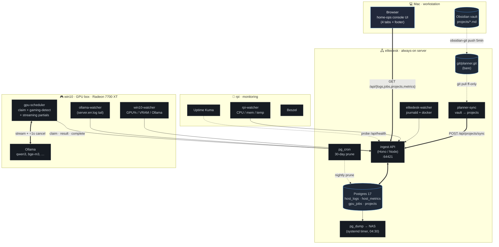

# home-ops — architecture at a glance

> One picture of what runs where, and how the pieces wire together.
> When the stack changes, update the diagram first, code second.

## The map



## What each piece does

| Component | Host | Role | Lifecycle |
| --- | --- | --- | --- |
| `ingest` | elitedesk | HTTP API in front of Postgres. Routes: `/api/{ingest,metrics,logs,jobs,projects,sources,health}`. Auth: ingest-token for machines, cookie for browser. | Docker compose, healthcheck on `/api/health` |
| `postgres` | elitedesk | Single Postgres. 4 tables, all jsonb-heavy. 30-day retention on logs+metrics, indefinite on failed/cancelled jobs. | Docker compose |
| `elitedesk-watcher` | elitedesk | Tails journald units (cloudflared, docker, ssh) + named docker container logs. Also samples host_metrics every 30s. | systemd-user |
| `planner-sync` | elitedesk | Pulls planner repo every 60s, parses `projects/*.md` frontmatter + sections, POSTs full snapshot to `/api/projects/sync` (upsert + delete-others). | systemd-user |
| `pg_cron` | elitedesk | Nightly prune of host_logs > 30d, gpu_jobs (done) > 30d. Inside the postgres container; no host-level cron. | pg_cron extension |
| `pg-backup` | elitedesk | `pg_dump -Fc` → NAS SMB share, 04:30 local, 14-day retention. | systemd-user timer |
| `gpu-scheduler` | win10 | Claims jobs from queue. Gaming-detect via GPU 3D-engine util + foreground exe. Streams partials every ~250ms during generation. Honours user cancel in ~1s. | WinSW service |
| `ollama` | win10 | LLM runtime. `/api/generate` (stream=true) + `/api/embed`. Models loaded as needed; `keep_alive=0` on pause to free VRAM. | Windows service |
| `win10-watcher` | win10 | Samples GPU util / VRAM / temperature via PowerShell. Logs Ollama metrics. | WinSW service |
| `ollama-watcher` | win10 | Tails `Ollama.err.log` → log events. | WinSW service |
| `rpi-watcher` | rpi | CPU / mem / disk / SoC temp every 30s. | systemd-user |
| `kuma` + `beszel` | rpi | External health probe + time-series visualisation (third-party tools). | docker |

## Scale & guarantees

- **Logs**: 50k–500k rows/day. Partial-batch accept on `/api/ingest` (one bad row no longer drops the flush). 30-day retention.
- **Metrics**: 30s sample interval × 3 hosts = ~260k rows/month. Tiny; 30-day retention.
- **Jobs**: order-of-magnitude tens-per-day during active use. `priority DESC, created_at ASC` SKIP LOCKED claim. Cancellation acknowledged in **~1s** (streaming + 1.5s poll).
- **Projects**: vault-derived, 13 tracked today. Joins to logs via `source = 'app:<slug>'`, to jobs via `payload.project`.
- **Streaming**: generate.py POSTs partials every 250ms or 30 chunks (whichever first). UI's 1.5s poll renders the `thinking` + `response` accumulation live.

## The three flows worth knowing

**1. A prompt → response**

```
browser  ──POST /api/jobs──▶  ingest  ──INSERT─▶  postgres
                                                       │
                                          claim_job (SKIP LOCKED)
                                                       ▼
   browser ◀──poll /api/jobs/:id──────────────  gpu-scheduler ──▶ ollama
                  (every 1.5s, picks up                │              │
                   partial.response + thinking)        ▼              │
                                          POST /api/jobs/:id/result ◀─┘
                                          (every 250ms during stream)
                                                       │
                                          POST /api/jobs/:id/complete
                                                       ▼
                                                  status='done'
```

**2. An event from any host → log line in the UI**

```
journalctl -f ──▶ elitedesk-watcher ──batch every 2s──▶ POST /api/ingest
                                                          │
                                                          ▼
                                                     INSERT host_logs
                                                          │
                            browser polls /api/logs?after=<id> ──▶ row appears
```

**3. An Obsidian vault edit → Projects tab**

```
edit projects/<slug>.md  ──▶  obsidian-git auto-commit (5min)
                                              │
                            push ──▶ elitedesk:git/planner.git (bare)
                                              │
                  planner-sync pulls every 60s, parses, POSTs
                                              │
                                              ▼
                                INSERT/UPDATE projects + DELETE others
                                              │
                  browser GET /api/projects ──▶ tab re-renders
```

## What's deliberately NOT here

- **Grafana / Prometheus** — see `adr/2026-06-07-no-grafana.md`. Metrics live in Postgres so logs and metrics are joinable. Beszel covers pretty charts.
- **Loki / Vector** — same database, same reason. The whole point is cross-pillar SQL joins.
- **Message broker / queue** — Postgres SKIP LOCKED handles the GPU job queue. One source of truth.
- **Multi-tenant anything** — single user behind Tailscale. No teams, no permissions, no audit.

## Related

- [`CONTEXT.md`](./CONTEXT.md) — project identity, data model, well-known data keys.
- [`DESIGN_BRIEF.md`](./DESIGN_BRIEF.md) — UI design brief.
- [`adr/`](./adr/) — architectural decision records.
- [`../README.md`](../README.md) — runbook + verify commands.
